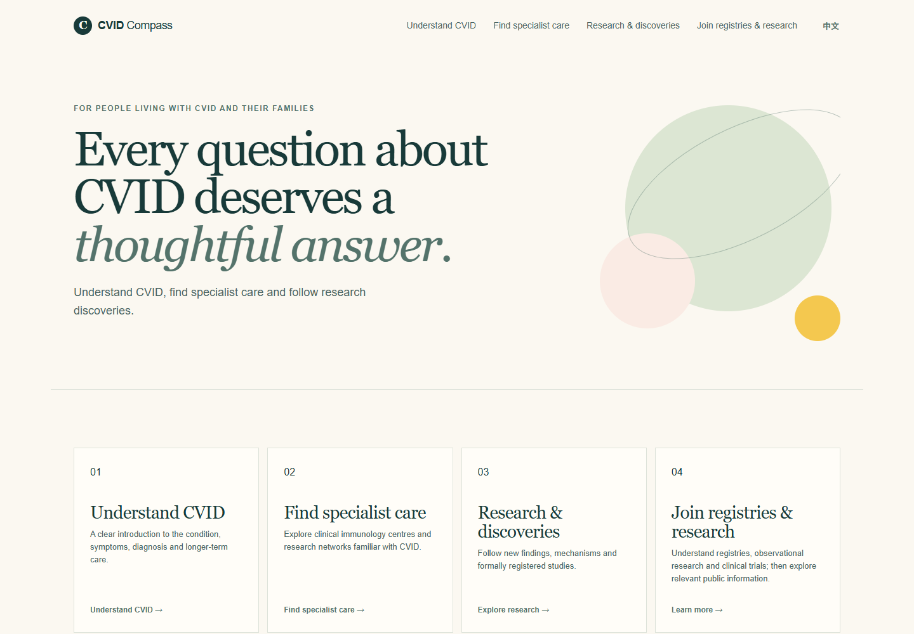
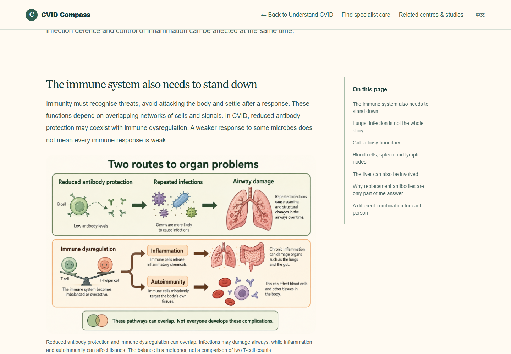
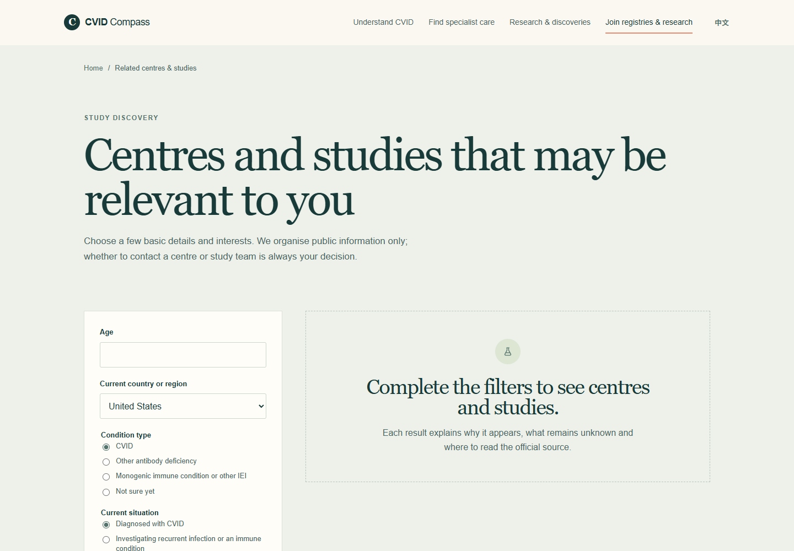

# CVID Compass

**Making complex immune science easier to understand—and relevant care and research easier to find.**

CVID Compass is an English–Chinese digital health prototype for people living with common variable immunodeficiency (CVID), their families and caregivers. It brings patient education, molecular mechanisms, research explainers, specialist-centre profiles and study discovery into one patient-facing experience.

**Demo URL:** [CVID Compass on GitHub Pages](https://lfr53.github.io/CVID-Compass/)

> This is the intended deployment address. It becomes available after GitHub Pages is enabled and the first deployment succeeds. The platform is a portfolio prototype; account creation, registration and notifications are demonstrations.

## Why this project exists

People navigating a rare immune condition often face two connected challenges: understanding complex medical information and finding services or research relevant to their circumstances. Information is scattered across publications, institutional websites and study registries, often written for professionals.

CVID Compass explores how a patient-centred information platform can connect those steps: understand the disease, explore specialist care, follow research and investigate opportunities for participation.

The project also examines a wider product question: how can patients, medical centres, researchers and life-science organisations benefit from a shared discovery platform while patients retain control over participation?

## What you can explore

| Area | Current experience |
| --- | --- |
| Understand CVID | Standalone articles covering infection, organ manifestations, laboratory results, genetic clues, immunoglobulin replacement and family support. |
| Immune molecules | A directory linking to 12 molecular explainers, with discussion of biological functions and associated immune conditions. |
| Research and discoveries | Patient-facing paper explainers that discuss findings, significance and limitations, with original sources. |
| Specialist centres | Individual profiles covering service populations, disease interests, referral information where available, and research evidence. Verification coverage varies by field and centre. |
| Related centres and studies | Filters based on basic characteristics and interests to explore potentially relevant public information. This does not determine clinical eligibility. |
| Registries and research participation | An educational article and optional demonstration of research-interest registration. |
| English and Chinese | Language switching across the patient experience. Translation and editorial review remain ongoing. |
| Responsive layout | Desktop and mobile layouts, standalone article navigation and illustrative mechanism diagrams. |

## Screenshots

Screenshots below are captured from the working local website, not design mockups.

### Homepage

### Understanding disease mechanisms

### Centre and study discovery

## The product journey

1. Read approachable explanations of CVID and its biology.
2. Explore specialist-centre profiles and research summaries.
3. Filter public information by basic characteristics and interests.
4. Follow official links to investigate services and study requirements.
5. Explore what voluntary research participation could involve.

Researchers and clinical teams—not this website—assess suitability for care or enrolment.

## Stakeholder value being explored

- **Patients and families:** clearer explanations, fewer disconnected searches and easier access to official information.
- **Medical centres:** clearer descriptions of their services and research interests.
- **Researchers:** better public understanding of study goals and participation.
- **Life-science organisations:** a possible future channel for transparent research awareness and aggregate demand insights.

These are product hypotheses, not demonstrated recruitment results. Demonstration metrics must not be interpreted as real patient activity.

## Portfolio focus

This project demonstrates patient-centred product design, medical knowledge translation, evidence-aware information architecture, bilingual content design and front-end implementation. It provides a concrete basis for discussing digital health product strategy, research engagement and partnership development.

It was developed with AI-assisted coding, drafting and illustration. AI assistance does not replace clinical review. A production launch would require further content validation and operational development.

## Data and implementation boundaries

- Public-source centre and study information may change; follow original sources for current details.
- Research explainers are educational and do not provide personal treatment advice.
- The current site has no production authentication, patient database, institutional messaging or email-delivery service.
- Interest forms are demonstrations and do not save or send submitted information.
- The discovery experience uses curated public information; it is not a validated clinical matching algorithm or a continuously synchronised registry feed.
- Do not submit identifiable medical records to this prototype.

## Technology

The deployed site is static HTML, CSS and JavaScript using browser modules and hash-based routes. It can be hosted directly on GitHub Pages without a build command. The repository may also contain local development helpers; these are not needed to serve the website.

## Deploy with GitHub Pages — browser only

1. Ensure the repository root contains `index.html`, `src/`, `assets/`, `content/`, `docs/` and this README.
2. Open **Settings → Pages**.
3. Under **Build and deployment**, choose **Deploy from a branch**.
4. Select **main** and **/(root)**, then click **Save**.
5. Wait for the Pages deployment to finish. The Pages settings screen will display the published URL.

Expected URL: **https://lfr53.github.io/CVID-Compass/**

For future browser uploads, preserve the folder structure and commit the changed files. GitHub Pages will redeploy from the selected branch.

## Next development priorities

- Continue medical and bilingual editorial review.
- Improve field-level verification and maintenance of centre and study records.
- Test usability with patients and caregivers.
- Validate discovery filters before considering more personalised functionality.
- Develop consent, authentication and secure communication only when moving beyond the static prototype.

## Sources and attribution

Articles and profiles include their own sources where available. Starting points include the [Immune Deficiency Foundation](https://primaryimmune.org/), [PubMed](https://pubmed.ncbi.nlm.nih.gov/) and [ClinicalTrials.gov](https://clinicaltrials.gov/).

Mechanism illustration notes are recorded in [illustration-notes.md](content/illustration-notes.md). Referenced publications and institutional names remain the property of their respective owners.
